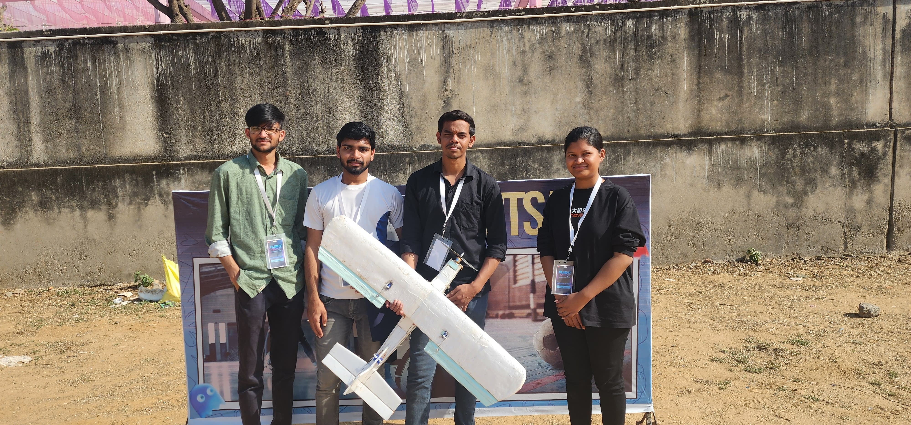
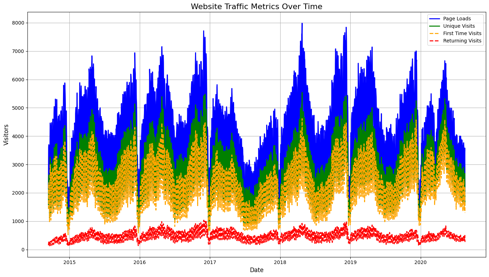
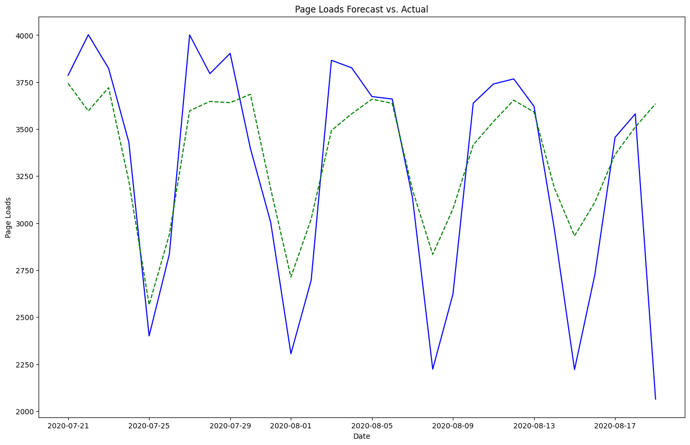

# My Portfolio

This is a personal portfolio website showcasing the skills, projects, experience, and contact information of Jaikishan Nishad, an aspiring Machine Learning Engineer and Data Scientist.

## Overview

The portfolio highlights:

- About section with personal background and skills
- Resume section detailing education, certifications, professional experience, and selected projects
- Projects section showcasing work in Computer Vision, NLP, Machine Learning, IoT, and Web Development
- Services section outlining domains of expertise
- Testimonials from mentors and collaborators
- Contact information and social media links

## Features

- Responsive design using Bootstrap
- Interactive portfolio filtering
- Animated typing effect on the hero section
- Integration of Google Maps for location
- Contact form (removed as per user request)
- Multiple project categories with images and descriptions

## Technologies Used

- HTML5, CSS3, JavaScript
- Bootstrap 5
- AOS (Animate On Scroll)
- Swiper.js for testimonials slider
- Google Fonts
- Google Maps Embed

## Screenshots

### Home Page Hero Section


### Projects Section


### Website Traffic Forecasting Project


## How to Use

1. Clone the repository:
   ```
   git clone https://github.com/Jaikishan1228/My-Portfolio.git
   ```
2. Open `index.html` in a web browser to view the portfolio.
3. Navigate through sections using the sidebar menu.

## License

This project is open source and available under the MIT License.

## Contact

For inquiries, please reach out via LinkedIn or GitHub profiles linked in the portfolio.
